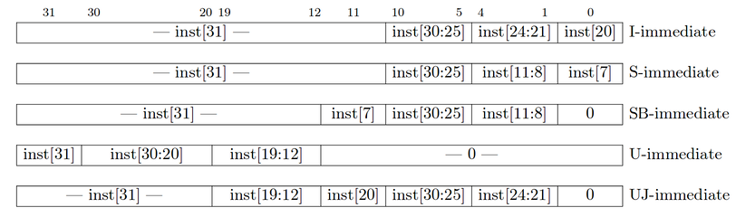

| **Instruction**           | **Type** | **Opcode** | **Funct3** | **Funct7 / Imm** | **Operation (运算逻辑)**                                |
| ------------------------- | -------- | ---------- | ---------- | ---------------- | ------------------------------------------------------- |
| **add** rd, rs1, rs2      | R        | 0x33       | 0x0        | 0x00             | R[rd] ← R[rs1] + R[rs2]                                 |
| **mul** rd, rs1, rs2      | R        | 0x33       | 0x0        | 0x01             | R[rd] ← (R[rs1] * R[rs2])[31:0]                         |
| **sub** rd, rs1, rs2      | R        | 0x33       | 0x0        | 0x20             | R[rd] ← R[rs1] - R[rs2]                                 |
| **sll** rd, rs1, rs2      | R        | 0x33       | 0x1        | 0x00             | R[rd] ← R[rs1] << R[rs2]                                |
| **mulh** rd, rs1, rs2     | R        | 0x33       | 0x1        | 0x01             | R[rd] ← (R[rs1] * R[rs2])[63:32]                        |
| **mulhu** rd, rs1, rs2    | R        | 0x33       | 0x3        | 0x01             | (unsigned) R[rd] ← (R[rs1] * R[rs2])[63:32]             |
| **slt** rd, rs1, rs2      | R        | 0x33       | 0x2        | 0x00             | R[rd] ← (R[rs1] < R[rs2]) ? 1 : 0 (signed)              |
| **xor** rd, rs1, rs2      | R        | 0x33       | 0x4        | 0x00             | R[rd] ← R[rs1] ^ R[rs2]                                 |
| **srl** rd, rs1, rs2      | R        | 0x33       | 0x5        | 0x00             | (unsigned) R[rd] ← R[rs1] >> R[rs2]                     |
| **sra** rd, rs1, rs2      | R        | 0x33       | 0x5        | 0x20             | (signed) R[rd] ← R[rs1] >> R[rs2]                       |
| **or** rd, rs1, rs2       | R        | 0x33       | 0x6        | 0x00             | R[rd] ← R[rs1] \| R[rs2]                                |
| **and** rd, rs1, rs2      | R        | 0x33       | 0x7        | 0x00             | R[rd] ← R[rs1] & R[rs2]                                 |
| **lb** rd, offset(rs1)    | I        | 0x03       | 0x0        |                  | R[rd] ← SignExt(Mem(R[rs1] + offset, byte))             |
| **lh** rd, offset(rs1)    | I        | 0x03       | 0x1        |                  | R[rd] ← SignExt(Mem(R[rs1] + offset, half))             |
| **lw** rd, offset(rs1)    | I        | 0x03       | 0x2        |                  | R[rd] ← Mem(R[rs1] + offset, word)                      |
| **addi** rd, rs1, imm     | I        | 0x13       | 0x0        |                  | R[rd] ← R[rs1] + imm                                    |
| **slli** rd, rs1, imm     | I        | 0x13       | 0x1        | 0x00             | R[rd] ← R[rs1] << imm                                   |
| ***slti** rd, rs1, imm*   | I        | 0x13       | 0x2        |                  | R[rd] ← (R[rs1] < imm) ? 1 : 0                          |
| **xori** rd, rs1, imm     | I        | 0x13       | 0x4        |                  | R[rd] ← R[rs1] ^ imm                                    |
| **srli** rd, rs1, imm     | I        | 0x13       | 0x5        | 0x00             | R[rd] ← R[rs1] >> imm                                   |
| **srai** rd, rs1, imm     | I        | 0x13       | 0x5        | 0x20             | R[rd] ← R[rs1] >> imm                                   |
| **ori** rd, rs1, imm      | I        | 0x13       | 0x6        |                  | R[rd] ← R[rs1] \| imm                                   |
| **andi** rd, rs1, imm     | I        | 0x13       | 0x7        |                  | R[rd] ← R[rs1] & imm                                    |
| **sb** rs2, offset(rs1)   | S        | 0x23       | 0x0        |                  | Mem(R[rs1] + offset) ← R[rs2][7:0]                      |
| **sh** rs2, offset(rs1)   | S        | 0x23       | 0x1        |                  | Mem(R[rs1] + offset) ← R[rs2][15:0]                     |
| **sw** rs2, offset(rs1)   | S        | 0x23       | 0x2        |                  | Mem(R[rs1] + offset) ← R[rs2]                           |
| **beq** rs1, rs2, offset  | SB       | 0x63       | 0x0        |                  | if(R[rs1] == R[rs2]) PC ← PC + {offset, 1b0}            |
| **bne** rs1, rs2, offset  | SB       | 0x63       | 0x1        |                  | if(R[rs1] != R[rs2]) PC ← PC + {offset, 1b0}            |
| **blt** rs1, rs2, offset  | SB       | 0x63       | 0x4        |                  | if(R[rs1] < R[rs2] (signed)) PC ← PC + {offset, 1b0}    |
| **bge** rs1, rs2, offset  | SB       | 0x63       | 0x5        |                  | if(R[rs1] >= R[rs2] (signed)) PC ← PC + {offset, 1b0}   |
| **bltu** rs1, rs2, offset | SB       | 0x63       | 0x6        |                  | if(R[rs1] < R[rs2] (unsigned)) PC ← PC + {offset, 1b0}  |
| **bgeu** rs1, rs2, offset | SB       | 0x63       | 0x7        |                  | if(R[rs1] >= R[rs2] (unsigned)) PC ← PC + {offset, 1b0} |
| **auipc** rd, offset      | U        | 0x17       |            |                  | R[rd] ← PC + {offset, 12b0}                             |
| **lui** rd, offset        | U        | 0x37       |            |                  | R[rd] ← {offset, 12b0}                                  |
| **jal** rd, imm           | UJ       | 0x6f       |            |                  | R[rd] ← PC + 4; PC ← PC + {imm, 1b0}                    |
| **jalr** rd, rs1, imm     | I        | 0x67       | 0x0        |                  | R[rd] ← PC + 4; PC ← R[rs1] + {imm}                     |
| **csrw** rd, csr, rs1     | I        | 0x73       | 0x1        |                  | CSR[csr] ← R[rs1]                                       |
| **csrwi** rd, csr, uimm   | I        | 0x73       | 0x5        |                  | CSR[csr] ← {uimm}                                       |

|  31-25   | 24-20 | 19-15 |  14-12   | 11-7 |   6-0    |
| :------: | :---: | :---: | :------: | :--: | :------: |
| `funct7` | `rs2` | `rs1` | `funct3` | `rd` | `opcode` |
|    7     |   5   |   5   |    3     |  5   |    7     |

